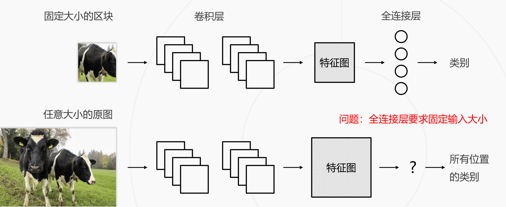
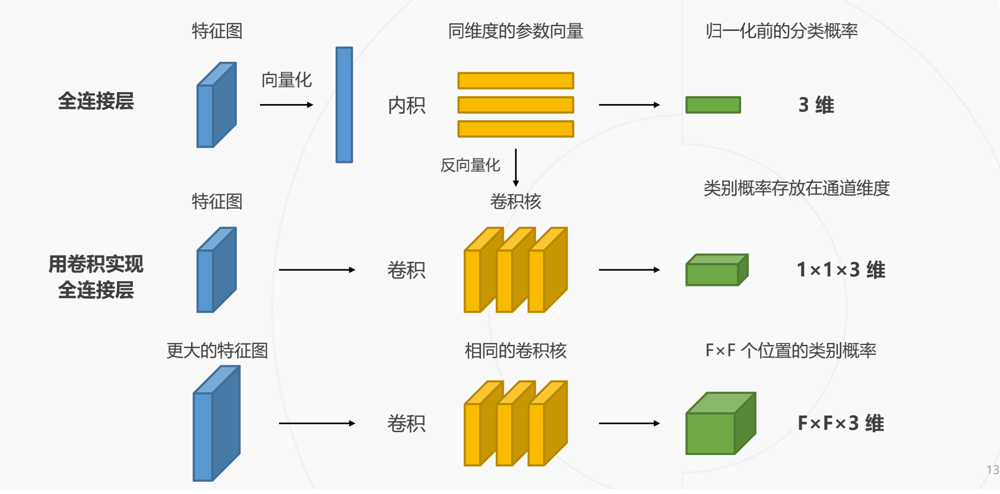
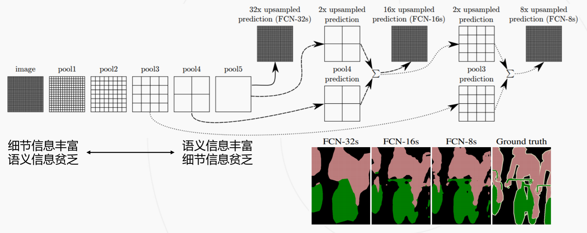
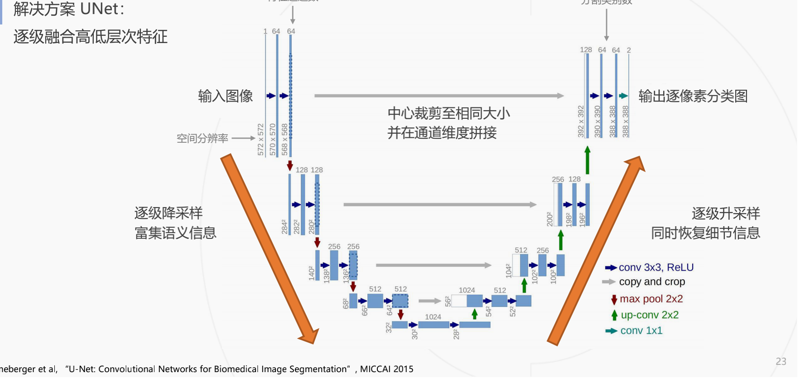
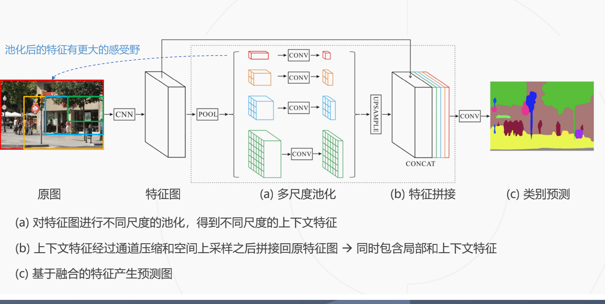
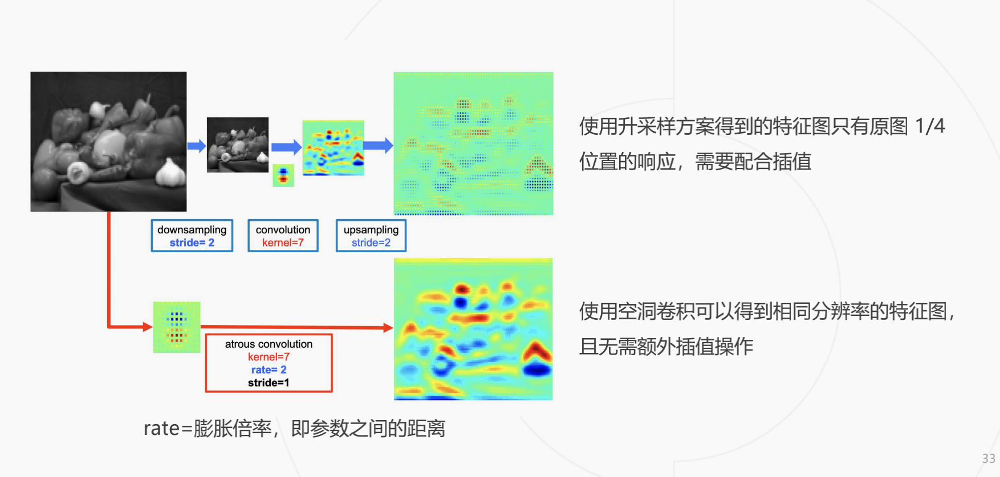

# 语义分割笔记

## 语义分割 vs 实例分割 vs 全景分割
### 语义分割
仅考虑像素的类别
不分割同一类的不同实体

### 实例分割
分割不同的实体
仅考虑前景物体

### 全景分割
背景仅考虑类别
前景需要区分实体

## 全连接层问题
需要图片的尺寸大小一致

改进方式
用卷积实现全链接层

### 预测图的上采样, 双线性插值
全卷积网络的预测与训练
基于多层级特征的上采样

问题：基于顶层特征预测，再升采样 32 倍得到的预测图较为粗糙。
解决思路：结合低层次和高层次特征图。

## FCN 网络
基于低层次和高层次特征图分别产生类别预测，升采样到原图大小，再平均得到最终结果

## Unet
其采用的编码器（下采样）-解码器（上采样）结构和跳跃连接是一种非常经典的设计方法。目前已有许多新的卷积神经网络设计方式，但很多仍延续了U-Net的核心思想，加入了新的模块或者融入其他设计理念
U-Net的结构如下图所示，左侧可视为一个编码器，右侧可视为一个解码器。编码器有四个子模块，每个子模块包含两个卷积层，每个子模块之后有一个通过max pool实现的下采样层。输入图像的分辨率是572x572, 第1-5个模块的分辨率分别是572x572, 284x284, 140x140, 68x68和32x32。由于卷积使用的是valid模式，故这里后一个子模块的分辨率等于（前一个子模块的分辨率-4）/2。解码器包含四个子模块，分辨率通过上采样操作依次上升，直到与输入图像的分辨率一致（由于卷积使用的是valid模式，实际输出比输入图像小一些）。该网络还使用了跳跃连接，将上采样结果与编码器中具有相同分辨率的子模块的输出进行连接，作为解码器中下一个子模块的输入

## Pspnet
基于多尺度预测

## deeplab 系列
DeepLab 是语义分割的又一系列工作，其主要贡献为：
• 使用空洞卷积解决网络中的下采样问题
• 使用条件随机场 CRF 作为后处理手段，精细化分割图
• 使用多尺度的空洞卷积（ASPP 模块）捕捉上下文信息
DeepLab v1 发表于 2014 年，后于 2016、2017、2018 年提出 v2、v3、v3+ 版本

### 空洞卷积

